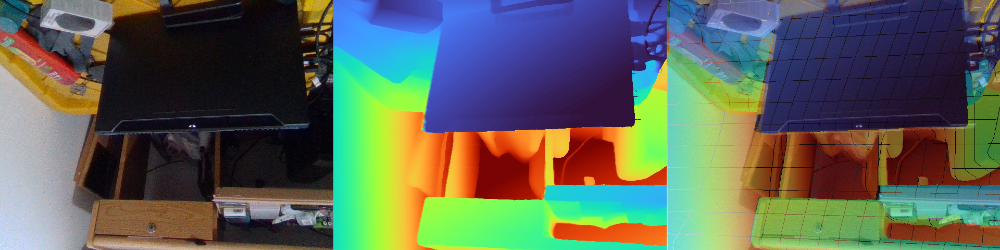

# deephpose

Profundidad estéreo densa con **FoundationStereo** (ViT-small `11-33-40`) sobre
pares IR de una **RealSense D415**, comparada con la profundidad original de la
cámara, proyectada a RGB y en vivo. Rumbo a **estimación de pose**.

| | |
|---|---|
| Plataforma | Windows 11 nativo (sin WSL / Conda / Docker) |
| GPU | RTX 4070 Laptop 8 GB · driver 591.74 |
| Python | 3.11 64-bit, gestionado con `uv` (`pyproject.toml` + `uv.lock`) |
| Cámara | D415 por USB 3.0 · 640×480@30 · IR1+IR2+depth+color |

## Instalación

```powershell
uv python pin 3.11
uv sync
```

- `torch 2.6.0+cu124` / `torchvision 0.21.0` / `xformers 0.0.29` desde el índice
  oficial de PyTorch (fijado en `pyproject.toml`, receta Windows del issue #219).
- `flash-attn` 2.8.3: wheel de terceros `kingbri1/flash-attention`
  (`cu124+torch2.6.0+cp311`, fijado en `uv.lock`). Sin adaptaciones de
  atención: el código FS no importa `flash` directamente.
- Un solo OpenCV: `opencv-contrib-python`.
- Pesos en `pretrained_models/11-33-40/` (`cfg.yaml` + `model_best_bp2.pth`,
  787 MB, Drive oficial — no van al repo). FoundationStereo clonado sin
  modificar en `third_party/` (`6e88068`); solo se adapta
  `torch.load(weights_only=False)` en nuestro wrapper (torch 2.6 cambió el
  default y el checkpoint es de 2025). Con red, timm/dinov2 bajan solos de HF.

## Uso

Todo corre desde la raíz. `config.toml` centraliza defaults (el CLI gana).

```powershell
# Pares estáticos
uv run python scripts/capture.py --emitter on          # data/raw/<sello>_emitter-on/
uv run python scripts/infer.py --capture data/raw/<sello>_emitter-on
uv run python scripts/project_to_rgb.py --fs data/processed/<sello>_fs --capture data/raw/<sello>
uv run python scripts/evaluate.py --fs data/processed/<sello>_fs --capture data/raw/<sello>

# En vivo (s=guardar, q=salir; --view both|fs|d415, --zoom, --scale, --valid-iters)
uv run python scripts/live.py --emitter on

# Demo oficial intacta
uv run python scripts/run_official_demo.py --scale 1
```

Cada captura guarda `left.png`, `right.png`, `color.png`,
`depth_original.npy` (uint16 intacto), `calibration.json` (intrínsecos IR+RGB,
extrínseco IR-izq→RGB, baseline real, depth scale) y `metadata.json`.

## Resultados medidos

`640×480, valid_iters=16, VRAM libre`: `t_load≈2.6 s`, `t_infer≈0.64 s`,
`vram≈1646 MiB`, AMP válida. Demo oficial 960×540 en 9.4 s.

| Escena | MAE FS↔D415 | Mediana | Válido conjunto |
|---|---|---|---|
| Emisor ON | 11.5 mm | 2.1 mm | 86.6% |
| Emisor OFF | 51.7 mm | 11.6 mm | 44.8% |

El emisor aporta **cobertura** D415, no precisión FS. D415 = comparación, no
ground truth. Figuras en `reports/figures/`, números en
`data/processed/*_eval/metrics.json`.



## Estructura

```
scripts/          capture, infer, live, evaluate, disparity_to_depth, project_to_rgb, fs_model, config
config.toml       defaults centrales
data/raw/         capturas inmutables (no va al repo)
data/processed/   disparidad, profundidad, nubes, evals (no va al repo)
notebooks/        marimo (03-compara pendiente)
reports/figures/  figuras versionadas
pretrained_models/  pesos (no van al repo)
third_party/      FoundationStereo intacto (no va al repo)
```

## Limitaciones y pendientes

- Con otro proceso en GPU, escala 1.0 murió sin traceback (~7.4/8 GB): medir
  siempre con VRAM libre; si falta, `--scale 0.5`.
- Sin Triton en Windows (aviso xformers benigno, no instalado por innecesario).
- Falta: exactitud absoluta con distancia conocida, repetibilidad controlada,
  validación en piezas (poca textura, bordes, reflejos) y notebook marimo.
- Siguiente fase: estimación de pose sobre la nube coloreada.
